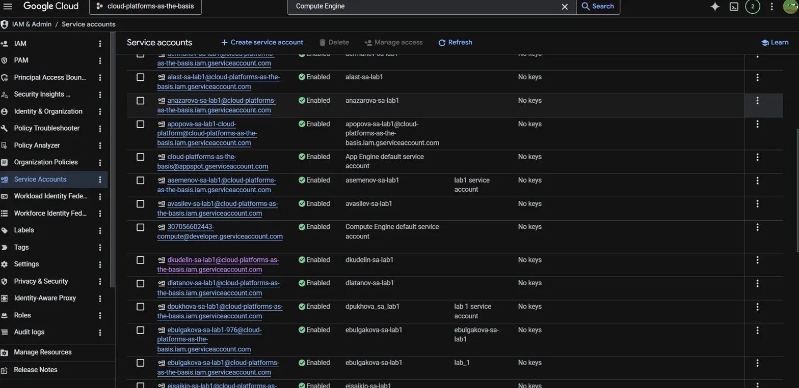
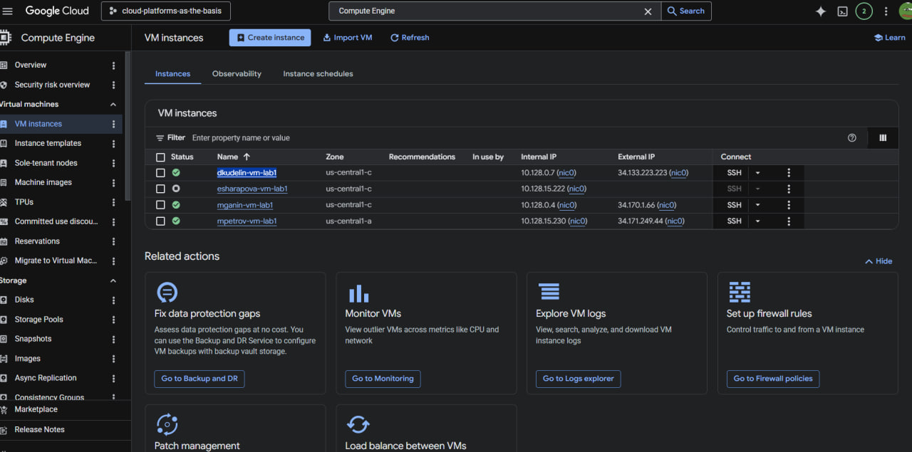
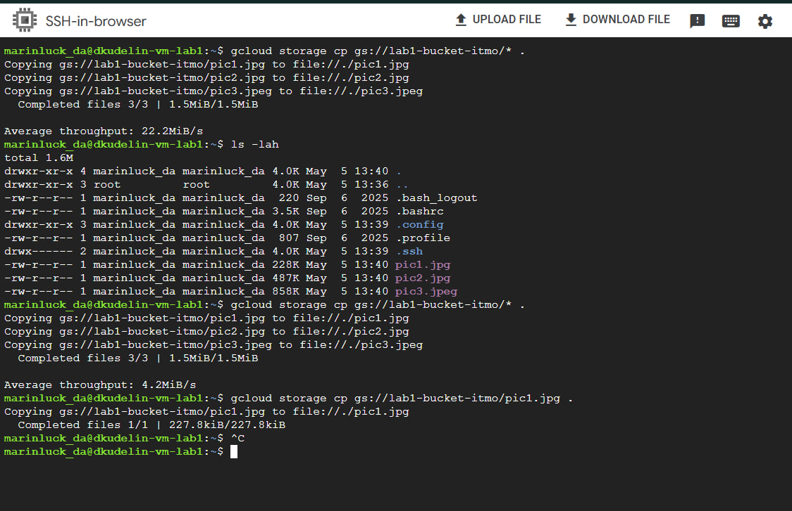
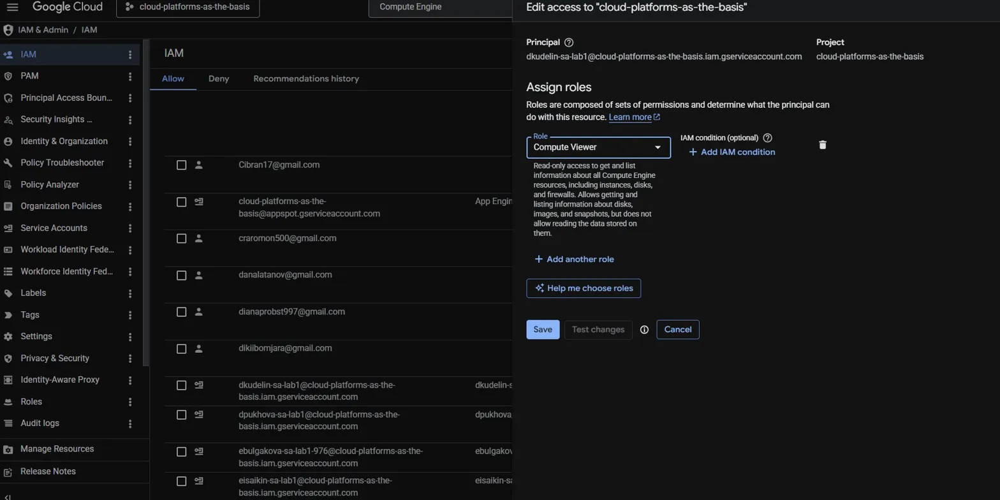
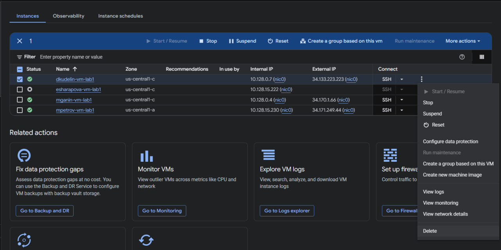

# Лабораторная работа №1: Обзор Google Cloud и исследование основных сервисов

## Информация о работе

| Параметр | Значение |
|----------|----------|
| **University** | ITMO University |
| **Faculty** | FICT |
| **Course** | Cloud platforms as the basis of technology entrepreneurship |
| **Year** | 2026 |
| **Group** | U4125 |
| **Author** | Kudelin Dmitry Igorevich |
| **Lab** | Lab1 |
| **Date of create** | 05.05.2026 |
| **Date of finished** | 05.05.2026 |

---

## Ход выполнения работы

### 1. Создание Service Account

На вкладке **Service Accounts** в Google Cloud Platform был создан сервисный аккаунт с именем `dkudelin-sa-lab1@cloud-platforms-as-the-basis.iam.gserviceaccount.com` с ролью **Storage Admin**, которая предоставляет полный доступ к облачному хранилищу.

**Скриншот Service Accounts:**



### 2. Создание виртуальной машины

Далее была создана виртуальная машина в **Compute Engine** со следующими параметрами:
- **Имя**: `dkudelin-vm-lab1`
- **Тип машины**: `e2-micro` (минимальный вариант для снижения затрат)
- **Режим**: `Spot` (экономный режим)
- **Зона**: `us-central1-c`

**Скриншот VM Instances:**



### 3. Копирование файлов из облачного хранилища

После создания VM было выполнено подключение через SSH и использована утилита `gcloud` для поиска и копирования файлов из бакета `lab1-bucket-itmo` на локальную директорию виртуальной машины.

**Команда:**

```bash
gcloud storage cp gs://lab1-bucket-itmo/* .
```

**Результат:**

```
✅ Скопировано 3 файла: pic1.jpg, pic2.jpg, pic3.jpeg
Размер: 1.5МiB/1.5МiB
Средняя скорость: 22.2МiB/s
```

**Проверка файлов на VM:**

```bash
ls -lah
```

**Скриншот терминала с файлами:**



### 4. Изменение прав доступа для Service Account

На следующем этапе были изменены права доступа для созданного service account в разделе **IAM & Admin → IAM**:
- **С**: `Storage Admin` (полный доступ к хранилищу)
- **На**: `Compute Viewer` (только чтение информации о Compute Engine)

Эта роль не предоставляет прав на доступ к данным в Cloud Storage, что должно было помешать копированию файлов.

**Скриншот изменения роли:**



### 5. Повторная попытка копирования после изменения прав

После изменения роли на `Compute Viewer` была предпринята повторная попытка копирования файлов:

```bash
gcloud storage cp gs://lab1-bucket-itmo/* .
```

**Результат:**

```
Несмотря на изменение роли service account с Storage Admin на Compute Viewer, файлы продолжили успешно скачиваться. Это указывает на то, что доступ обеспечивался не через роли service account, а через другой механизм (например, публичный доступ к бакету).
```

### 6. Удаление ресурсов

В завершение работы виртуальная машина была остановлена и удалена через консоль **Compute Engine**.

**Скриншот удаления:**



---

## Вывод

### Анализ результатов

На начальном этапе работы доступ к файлам в бакете `lab1-bucket-itmo` был успешно получен с помощью утилиты `gcloud storage cp`. Однако при изменении роли service account с `Storage Admin` на `Compute Viewer` (которая предоставляет только права на чтение информации о Compute Engine ресурсах), операции копирования файлов **продолжали работать успешно**.

Это неожиданное поведение свидетельствует о том, что доступ к файлам в бакете осуществлялся не через механизм IAM для service account, а через другой механизм управления доступом, вероятнее всего через **публичный доступ** (роль `allUsers` с правом `StorageObjectViewer` на уровне бакета).

### Ключевые выводы

1. **IAM роли в Google Cloud** - это мощный механизм контроля доступа, который определяет, какие операции может выполнять principal (пользователь, service account и т.д.)

2. **Приоритет правил доступа** - публичный доступ на уровне бакета может переопределить более строгие ограничения на уровне service account

3. **Важность понимания механизмов доступа** - для корректной настройки безопасности в облачной среде необходимо учитывать не только роли IAM, но и другие механизмы управления доступом (например, публичный доступ, сигнированные URL и т.д.)

4. **Принцип наименьших привилегий** - лучшей практикой является выдача только необходимых прав доступа и регулярная проверка конфигурации безопасности

---

## Использованные ресурсы

- Google Cloud Platform Console
- Cloud IAM & Admin
- Compute Engine
- Cloud Storage
- gcloud CLI

---

**Подпись автора:** Куделин Дмитрий Игоревич  
**Дата:** 05.05.2026
