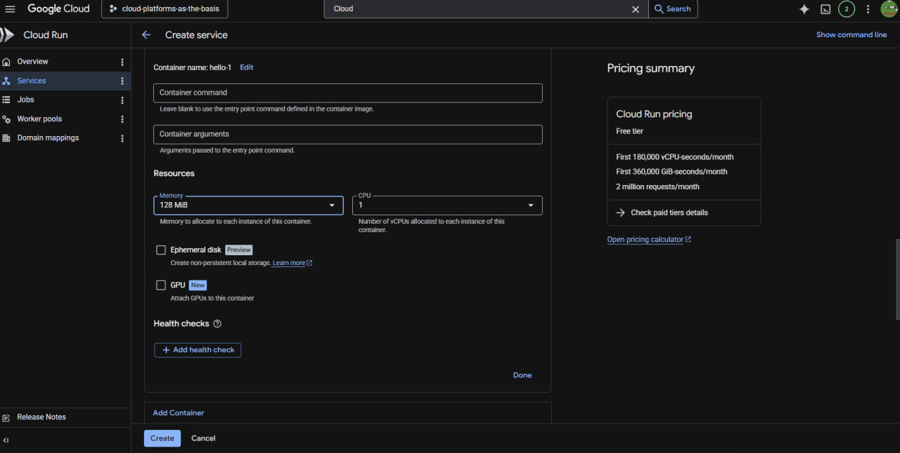
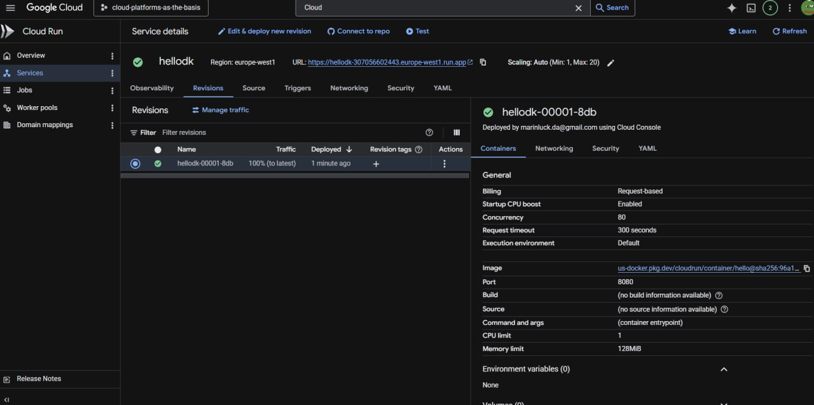
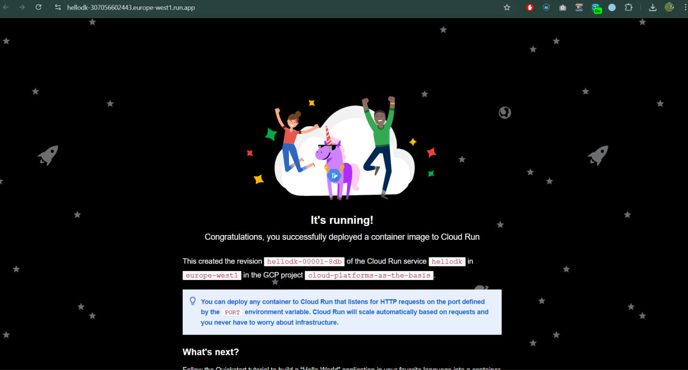
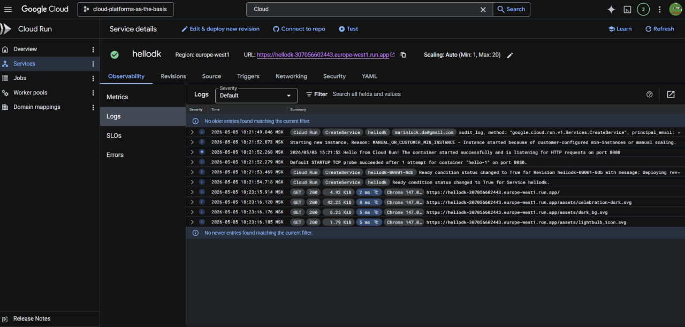
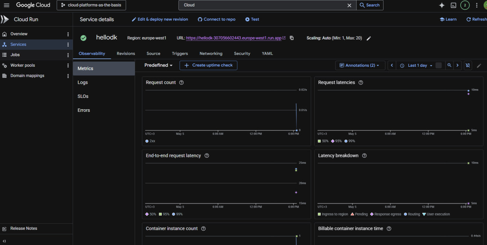
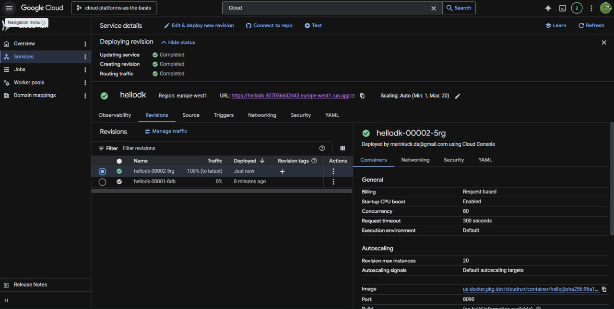
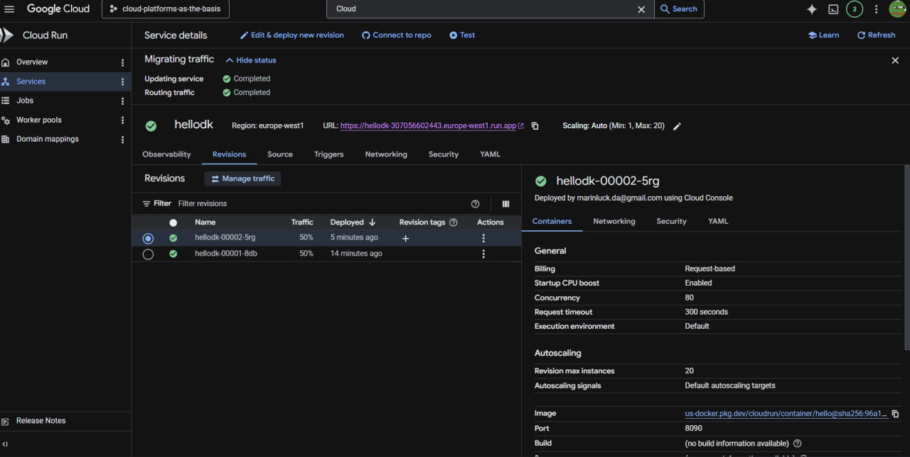

# Лабораторная работа №2: Развертывание и управление сервисами в Google Cloud Run

## Информация о работе

| Параметр | Значение |
|----------|----------|
| **University** | ITMO University |
| **Faculty** | FICT |
| **Course** | Cloud platforms as the basis of technology entrepreneurship |
| **Year** | 2026 |
| **Group** | U4125 |
| **Author** | Kudelin Dmitry Igorevich |
| **Lab** | Lab1 |
| **Date of create** | 05.05.2026 |
| **Date of finished** | 05.05.2026 |

---

## Ход работы

### 1. Настройка и деплой первого сервиса
Для начала работы в Cloud Run был выбран демонстрационный образ контейнера. В процессе конфигурации были заданы лимиты ресурсов для оптимизации работы сервиса:
*   **Memory:** 128 MiB
*   **CPU:** 1
*   **Autoscaling:** ограничение до 20 инстансов.

После завершения процесса деплоя была создана первая ревизия `hellodk-00001-8db`.

### 2. Проверка работоспособности
Сервис успешно запустился и стал доступен по публичному URL. На странице отображается стандартное приветствие Google Cloud Run ("It's running!").

### 3. Мониторинг: Логи и Метрики
С помощью инструментов вкладки **Observability** был проведен анализ работы системы:
*   В разделе **Logs** зафиксированы события старта контейнера и успешные HTTP-ответы (код 200).
*   В разделе **Metrics** отображены графики Request Count, подтверждающие обработку входящих запросов.

### 4. Создание новой ревизии и изменение порта
Для тестирования механизмов обновления была создана вторая ревизия `hellodk-00002-5rg`. В настройках контейнера порт был изменен с дефолтного 8080 на **8090**. 

### 5. Управление трафиком (Canary Deployment)
Используя функцию **Manage Traffic**, было настроено распределение нагрузки. Трафик был разделен поровну (**50% на 50%**) между первой (стабильной) и второй (тестовой) ревизиями. Это позволяет проверять новые версии приложения на части пользователей.

---

## Вывод
В ходе работы были освоены базовые операции в Cloud Run: развертывание из образа, настройка ресурсов, работа с системой логирования и гибкое управление трафиком. Инструмент ревизий позволяет эффективно реализовать стратегии плавного обновления приложений без простоя системы.
