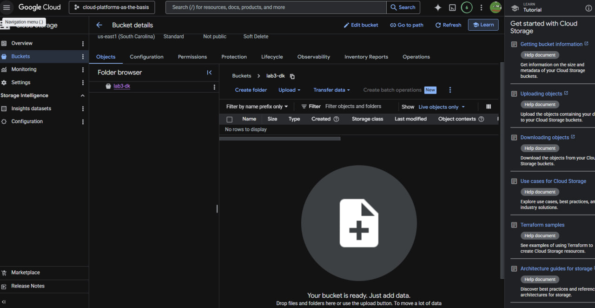
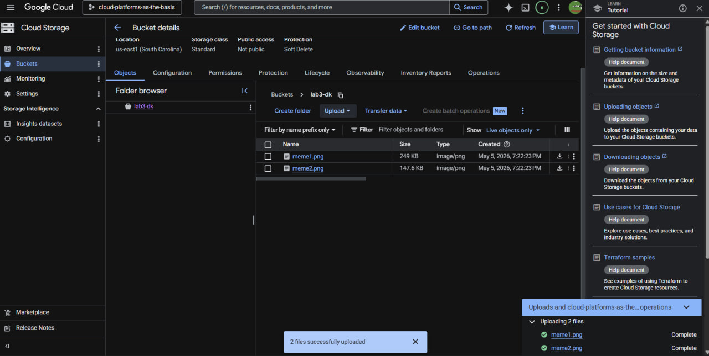
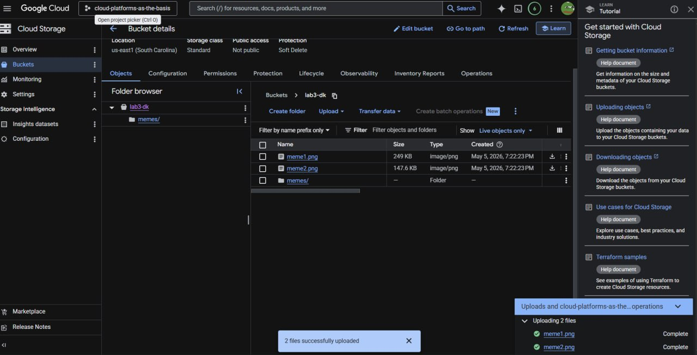
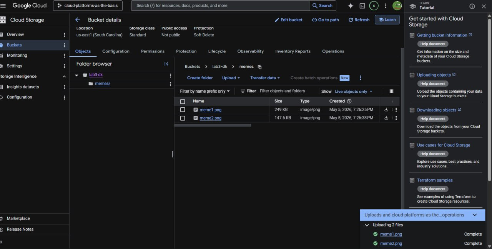

# Лабораторная работа №3: Исследование Cloud Storage

**Выполнил:** Дима (dimak)
**Курс:** Облачные платформы как основа технологий предпринимательства

---

## Цель работы
Ознакомиться с принципами работы объектного хранилища Google Cloud Storage, научиться управлять бакетами, структурировать данные внутри хранилища и настраивать права публичного доступа.

---

## Ход работы

### 1. Создание бакета и загрузка данных
В рамках существующего проекта был создан бакет с уникальным именем `lab3-dk`. Для хранения выбраны стандартные параметры (Standard storage class, регион us-east1). После создания в бакет были загружены графические файлы.

### 2. Структурирование хранилища
Для организации данных внутри бакета была создана папка `memes/`. Все загруженные ранее изображения были перемещены в эту директорию для демонстрации работы с файловой структурой объектного хранилища.

### 3. Настройка публичного доступа
Для того чтобы файлы были доступны по прямым ссылкам без авторизации, были изменены настройки разрешений (Permissions):
*   Добавлен новый субъект: `allUsers`.
*   Назначена роль: `Storage Object Viewer`.
После этого файлы получили статус "Public to internet".

### 4. Тестирование публичных ссылок
Для проверки корректности настроек доступа были сформированы публичные URL-адреса. При переходе по ссылкам изображения успешно открываются в браузере.

---

## Вывод
В ходе работы были изучены основные операции с Cloud Storage: создание бакетов, загрузка и перемещение объектов, а также управление политиками доступа (IAM). Объектное хранилище является эффективным инструментом для хранения статического контента приложений с возможностью гибкой настройки публичной доступности.

---
*Все созданные ресурсы были удалены после завершения работы для оптимизации облачных затрат.*
