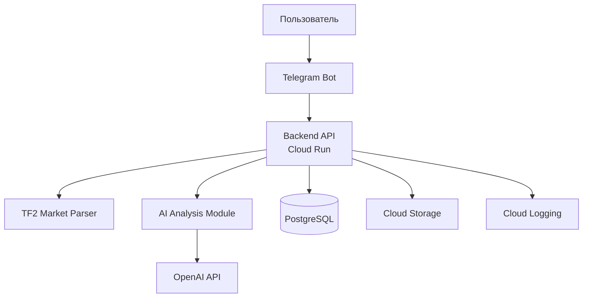
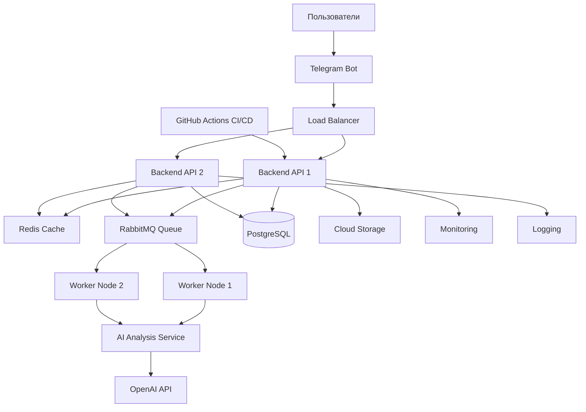
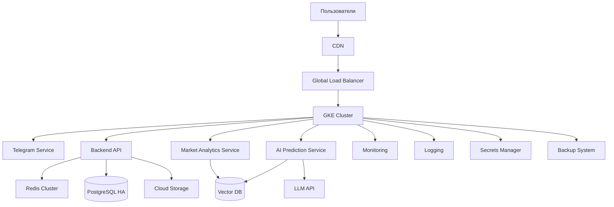

# Лабораторная работа 4. Разработка инфраструктуры MVP AI приложения

## Информация о работе

| Параметр | Значение |
|----------|----------|
| **University** | ITMO University |
| **Faculty** | FICT |
| **Course** | Cloud platforms as the basis of technology entrepreneurship |
| **Year** | 2026 |
| **Group** | U4125 |
| **Author** | Kudelin Dmitry Igorevich |
| **Lab** | Lab3 |
| **Date of create** | 08.05.2026 |
| **Date of finished** | 08.05.2026 |

---

# Цель работы

Разработать инфраструктуру MVP AI-приложения для анализа рынка предметов Team Fortress 2, продумать архитектуру системы на разных этапах развития продукта, оценить стоимость эксплуатации и обосновать выбор облачных ресурсов.

---

# Описание приложения

В качестве MVP рассматривается AI-приложение для анализа рынка предметов Team Fortress 2 и автоматического поиска выгодных сделок.

Пользователь может:

* анализировать цены предметов;
* получать уведомления о выгодных сделках;
* хранить историю торговых операций;
* получать AI-анализ рынка;
* взаимодействовать с системой через Telegram-бота.

Приложение развивается в 3 этапа:

1. Начальное MVP
2. Тестирование партнёрами
3. Production-решение

---

# Ход работы

## Этап 1 — Начальное MVP

На первом этапе основная задача — быстро протестировать идею и минимизировать расходы.

Используемые сервисы:

* Telegram Bot API
* Backend API — Cloud Run
* База данных — PostgreSQL
* AI API — OpenAI API
* Хранение логов и данных — Cloud Storage
* Мониторинг — Cloud Logging

### Архитектура MVP

### Обоснование выбора

* **Cloud Run** позволяет быстро запускать backend без администрирования серверов.
* **PostgreSQL** подходит для хранения информации о предметах и истории торговли.
* **Cloud Storage** используется для хранения логов и данных анализа.
* Использование внешнего AI API упрощает разработку MVP.
* Telegram-бот обеспечивает быстрый запуск без необходимости разработки отдельного frontend.

### Предполагаемая нагрузка

* до 100 пользователей;
* до 5000 запросов в день;
* небольшой объём торговых данных.

### Примерная стоимость

| Ресурс | Стоимость в месяц |
| ------------- | ----------------- |
| Cloud Run | ~$5 |
| PostgreSQL | ~$10 |
| Cloud Storage | ~$2 |
| Logging | ~$1 |
| OpenAI API | ~$15 |
| Telegram Bot | ~$0 |
| **Итого** | **~$33/мес** |

---

# Этап 2 — Тестирование партнёрами

После появления первых пользователей инфраструктура должна стать более стабильной и масштабируемой.

Добавляются:

* Load Balancer
* Redis Cache
* Очереди задач
* CI/CD pipeline
* Monitoring & Alerts

### Архитектура этапа тестирования

### Обоснование выбора

* **Load Balancer** распределяет нагрузку.
* **Redis Cache** ускоряет получение цен предметов.
* **RabbitMQ** позволяет обрабатывать задачи анализа асинхронно.
* **Worker Nodes** выполняют параллельный анализ рынка.
* CI/CD ускоряет обновление приложения и упрощает разработку.

### Предполагаемая нагрузка

* до 5000 пользователей;
* до 100000 запросов в день;
* постоянный анализ цен и торговых площадок.

### Примерная стоимость

| Ресурс | Стоимость в месяц |
| -------------------- | ----------------- |
| Backend instances | ~$40 |
| PostgreSQL | ~$30 |
| Redis | ~$15 |
| RabbitMQ | ~$10 |
| Cloud Storage | ~$5 |
| Monitoring & Logging | ~$15 |
| OpenAI API | ~$150 |
| **Итого** | **~$265/мес** |

---

# Этап 3 — Production

На production этапе основной акцент делается на отказоустойчивость, безопасность и масштабируемость.

Добавляются:

* Kubernetes (GKE)
* CDN
* Vector Database
* Multi-zone deployment
* Secrets Manager
* Backup system

### Архитектура Production

### Обоснование выбора

* **GKE** обеспечивает автоматическое масштабирование контейнеров.
* **PostgreSQL HA** повышает отказоустойчивость системы.
* **Vector DB** используется для AI-анализа рынка и поиска паттернов.
* **CDN** ускоряет доступ пользователей к сервису.
* **Secrets Manager** безопасно хранит API-ключи и конфиденциальные данные.
* Backup system повышает надежность инфраструктуры.

### Предполагаемая нагрузка

* более 50000 пользователей;
* миллионы запросов;
* постоянный анализ торговых площадок в реальном времени.

### Примерная стоимость

| Ресурс | Стоимость в месяц |
| -------------------- | ----------------- |
| GKE | ~$300 |
| PostgreSQL HA | ~$150 |
| Redis Cluster | ~$80 |
| Load Balancer + CDN | ~$70 |
| Vector DB | ~$100 |
| Cloud Storage | ~$40 |
| Monitoring & Logging | ~$50 |
| Backup System | ~$30 |
| OpenAI API | ~$1200 |
| **Итого** | **~$2020/мес** |

---

# Сравнение этапов

| Этап | Основная цель | Технологии | Стоимость |
| ------------ | ------------------ | --------------------- | --------- |
| MVP | Быстрый запуск | Cloud Run + PostgreSQL | ~$33 |
| Тестирование | Масштабирование | Redis + RabbitMQ | ~$265 |
| Production | Отказоустойчивость | GKE + Vector DB | ~$2020 |

---

# Выводы

В ходе лабораторной работы была спроектирована инфраструктура AI-приложения для анализа рынка предметов Team Fortress 2 и автоматического поиска выгодных сделок.

Основные выводы:

* На раннем этапе важно минимизировать расходы и быстро протестировать идею.
* Serverless-решения хорошо подходят для MVP.
* По мере роста нагрузки требуется кеширование, балансировка и асинхронная обработка задач.
* Production-инфраструктура должна обеспечивать масштабируемость, безопасность и отказоустойчивость.
* Не всегда самое дешёвое решение является оптимальным в долгосрочной перспективе — важно учитывать дальнейший рост продукта.
